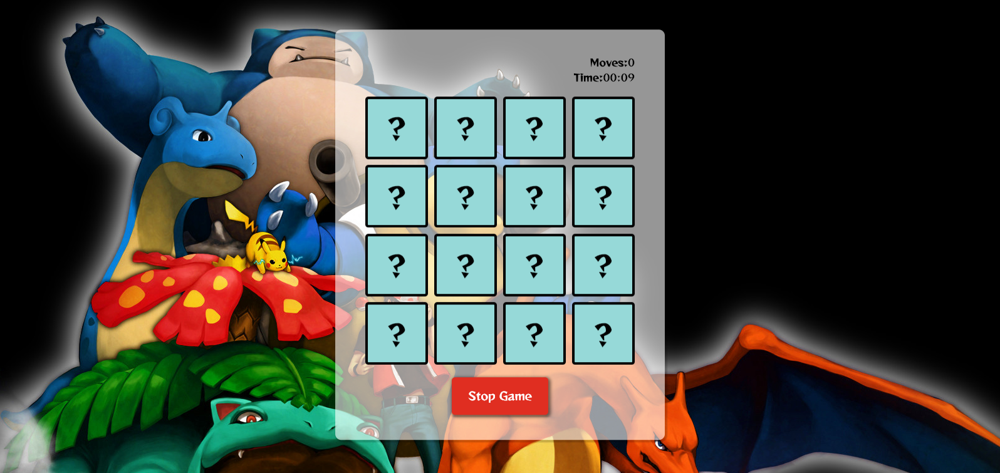

## Pokémon Memory Card Game

### Game Overview

The Pokémon Memory Card Game is a classic puzzle game where players try to find matching pairs of Pokémon cards.

### Screenshot

### How to Play

1. Press on start Game.
2. The player flips over two cards to reveal their Pokémon images.
3. If the cards match, they remain face up and the player scores a point.
4. If the cards do not match, they are turned back over and the player's turn ends.
5. The game continues until all cards have been matched.
6. The player with the most points (i.e., the most matched pairs) wins the game.

### Winning Conditions

The game is won when all cards have been matched, and the player has the most points.

### Game Instructions

Match all the cards! When you've matched every pair, press "Stop Game" to stop the timer and get your result.

## live Demo

you can fine the game online on [Netlify](https://b-pokemon-memory-game.netlify.app/)

> I hope you like it 😊 . Enjoy!

